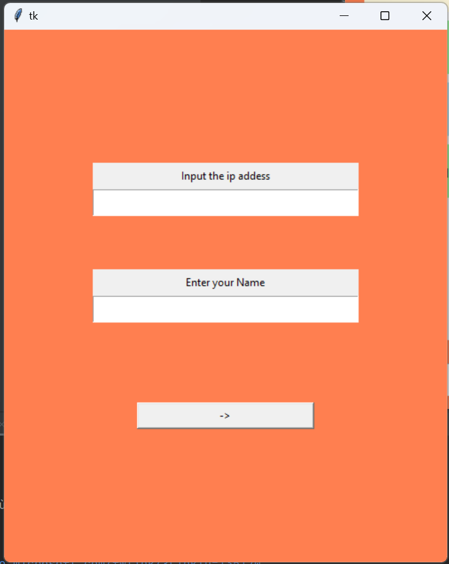
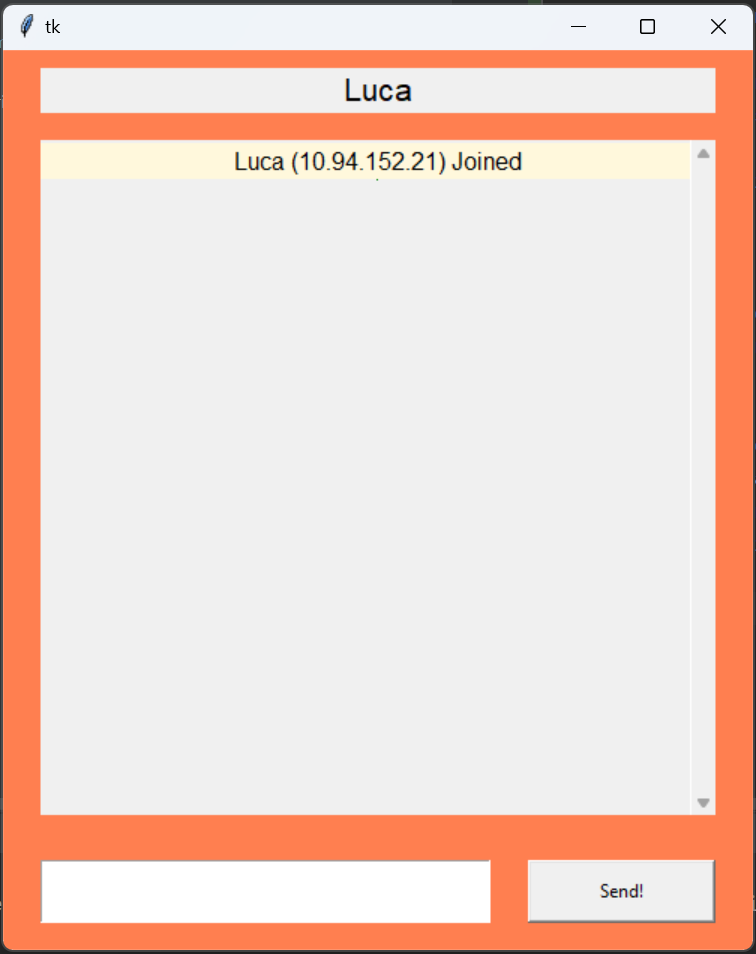
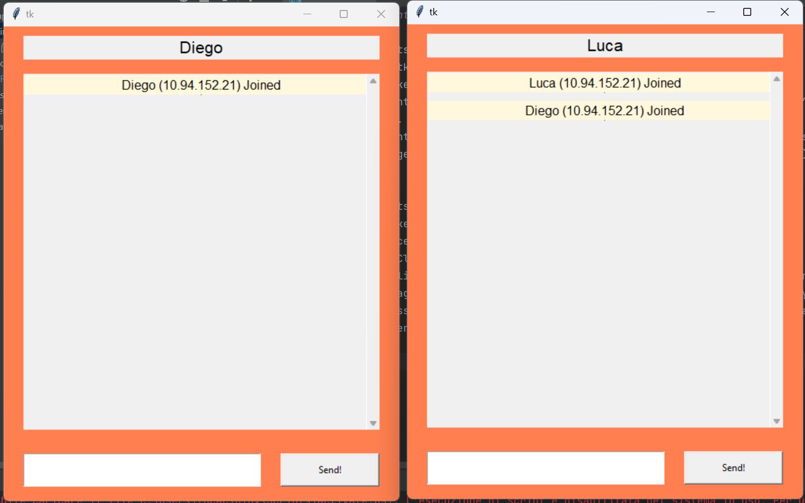
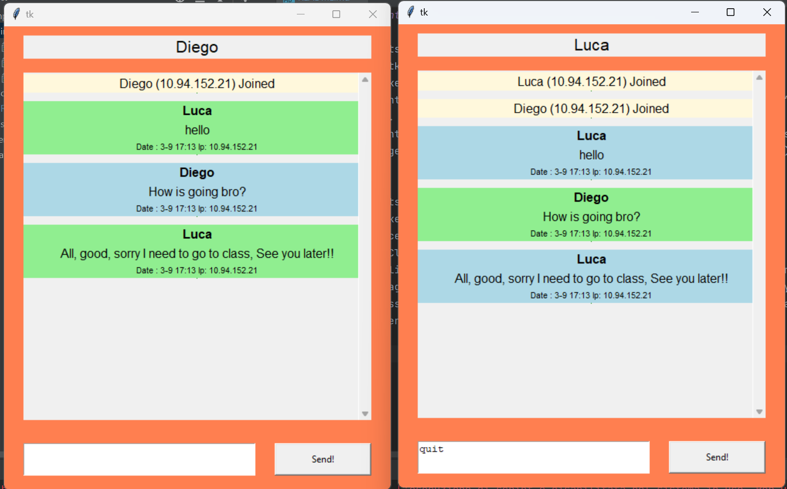
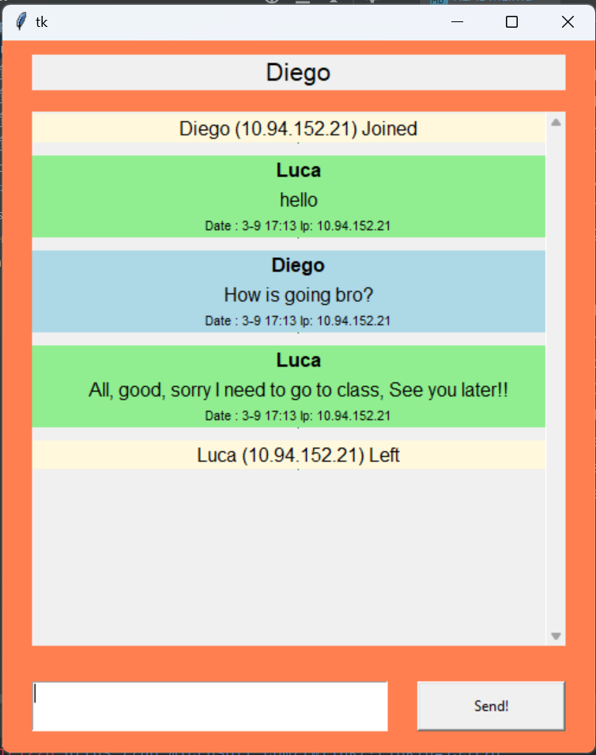
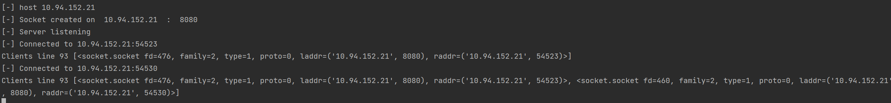
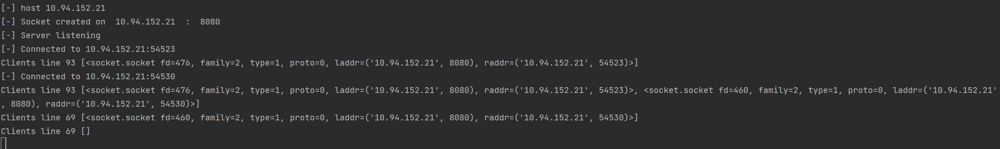

# Create a Messaging App
## Assigment for Distributed Network Systems MCSBT IE

> Objective:
> Create a severer and client in python, so that multiple client can connect to the server and exchange
> messages with each other. The client must be able to connect from different computer just like a real app.

This program is a chat app developed as part of my MCSBT at IE university. It involves creating a GUI using Tkinter,
creating a server and client that can connect using the socket library.
Both the server and the client use TCP connection due to the packet nature of a messaging app.
Both the client and the server use multithreading in order to work.

### Requirements

Client:
- Use the tkinter library for local GUI
- Use “socket library” to manage the connection
- The Client quits typing “quit” on the App to close the connection. When “quit” message is sent to the server, the socket is closed by
the Client.
- The Client requires in the GUI the IP (of the server) to connect to the server.
- The messages can be seen in a window of the Client indicating who (the IP) published the message.
- Client must be able to connect from computers different from the one of the server

Server:
- Use “socket library” to manage the connection
- A single py file that acts as a Server
- Several Clients can connect to the server
- When a client connects the Server permits the connection, store in an array variable the new session of the client (to control the sessions established) and
sends message to all clients already connected (inf from the previous array) informing about the new peer
- Every message from the Client is broadcast to the rest of the clients already connected
- The server eliminates the control of the client session In the array when the socket is closed.

### Application in work

#### Client
> 1. Set Client and Server information

> 2. Client Connected to Server

> 3. Multiple Clients Connected to Server

> 4. Chat in progress

> 5. User Disconnects

#### Server
> 1. The client established connections

> 2. The client when all connection ended, waiting for new connections

